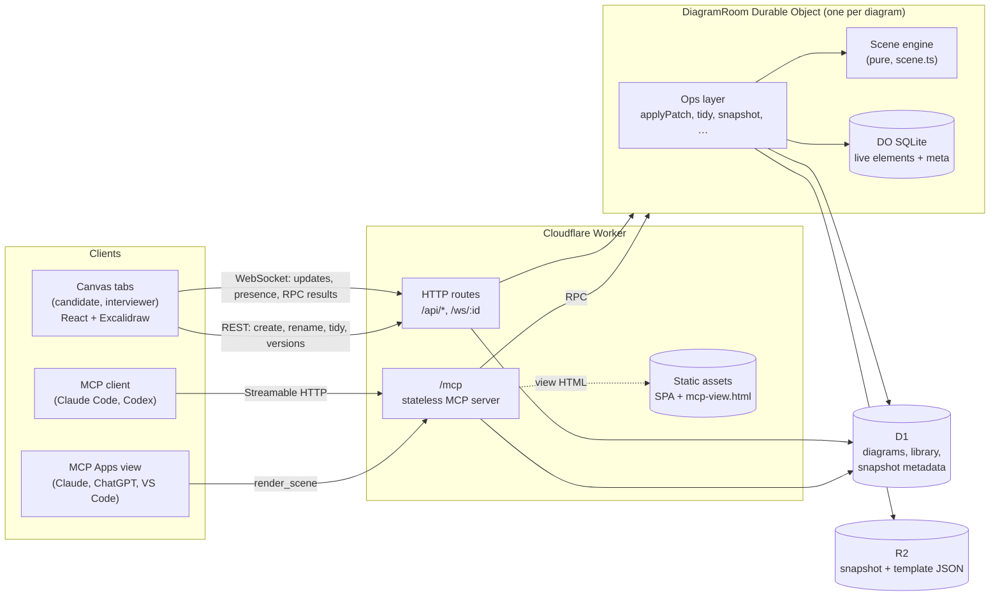
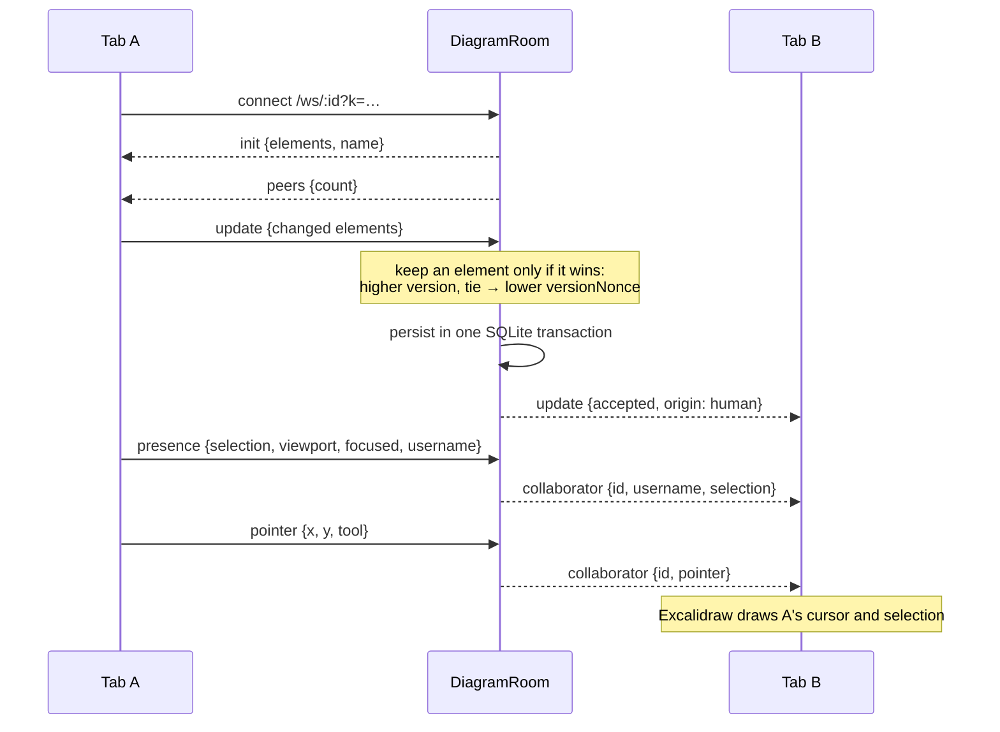
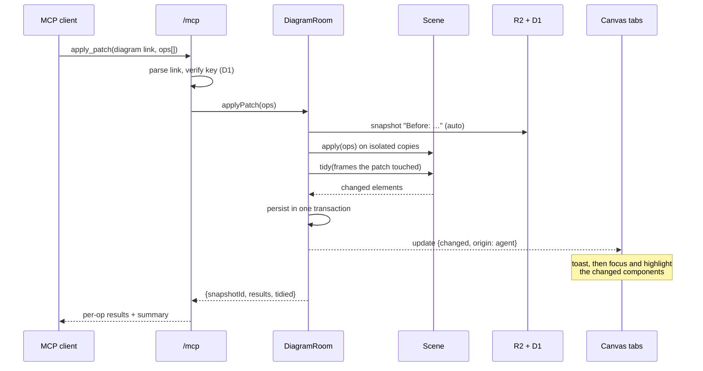
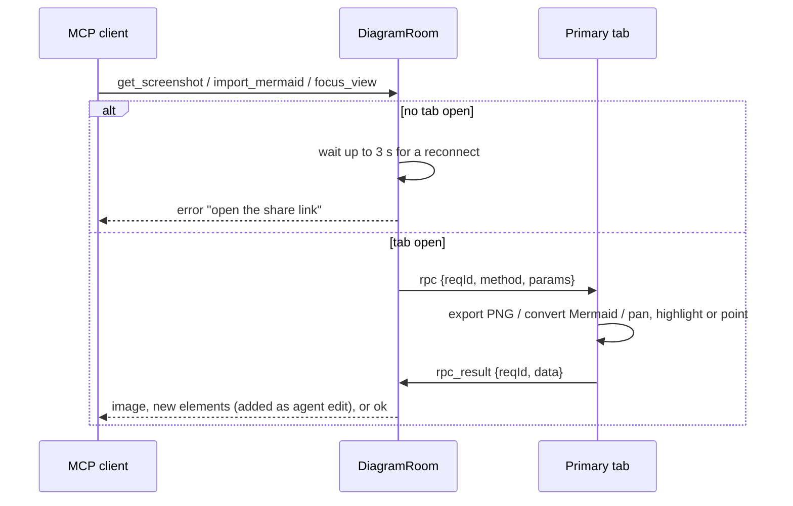
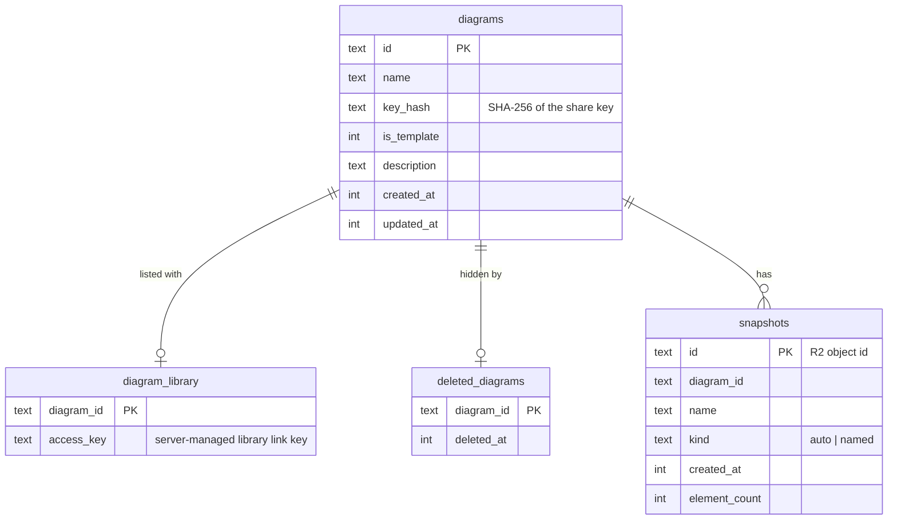
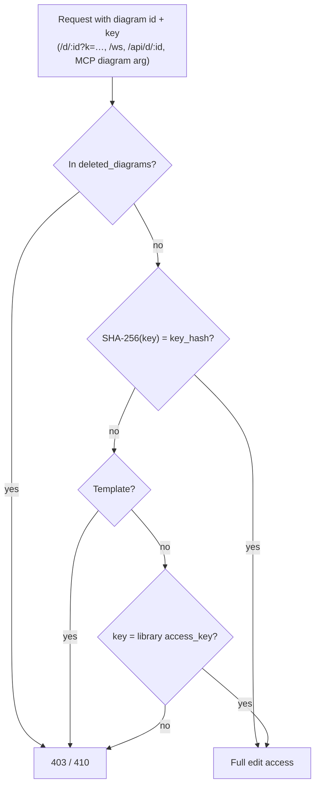
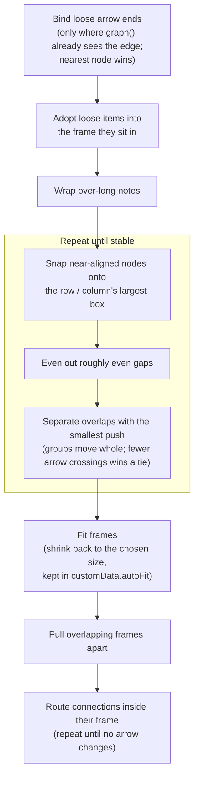
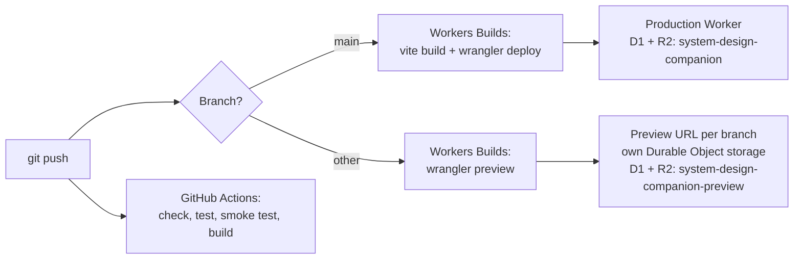

# System Design Companion — Design

A collaborative Excalidraw canvas that a candidate, an interviewer and an AI agent (Claude
Code or Codex over MCP) edit together in real time. What it does is in the
[README](../README.md); how to run it is in [setup.md](setup.md).

## Architecture

- **DiagramRoom** (`src/worker/room.ts`) is the core. It owns the live scene, merges
  concurrent edits, relays presence between tabs, and exposes an **ops layer**
  (`applyPatch`, `tidy`, `layout`, `snapshot`, `restore`, `focusView`, …). The HTTP
  routes and MCP are thin adapters over it, so a future in-room agent can reuse it.
- **Scene engine** (`src/worker/scene.ts`) is pure: it takes elements, applies semantic
  ops, placement, tidy and layout, and reports the changed elements. It has no I/O, which
  is why most of the test suite runs against it directly.
- **MCP endpoint** (`/mcp`, SDK v2 `@modelcontextprotocol/server`) is fully stateless, per
  the 2026-07-28 spec. The diagram's **share link is the handle**: every diagram tool takes
  it as the `diagram` argument, and the server stores nothing per agent. (The Agents SDK's
  `McpAgent` only supports SDK v1, so it isn't used.)
- **Frontend** (`src/app/`): Vite + React + `@excalidraw/excalidraw`, served as Workers
  static assets. Canvas chrome uses Excalidraw's own menus, sidebars, footer and
  collaborator rendering (see `AGENTS.md`).
- **MCP Apps view** (`src/view/`): a small bundle built into `public/mcp-view.html`.
  Clients that support MCP Apps show it for `get_scene`; it draws the scene with roughjs
  from `render_scene`.

## Edits and sync

### Human edits and presence

- Merging uses Excalidraw's element versioning, and each tab reconciles incoming updates
  with `reconcileElements`. Deletions are tombstones (`isDeleted`), so they sync like any
  other change. The room drops a tombstone 7 days after the delete (`TOMBSTONE_TTL_MS`),
  and only while no tab is connected, so a tab can only miss a delete if it stayed
  offline for longer than that.
- Each tab's presence is stored on its WebSocket attachment, so it survives Durable Object
  hibernation. The most recently focused tab is the "primary" one for tab RPCs.

### Agent edits

- Every `apply_patch`, `import_mermaid` and `layout` batch takes an automatic snapshot
  first, named after the change (`patchSnapshotName`), so `restore` undoes it.
- Scene edits run on cloned elements. If persisting fails, the transaction rolls back and
  nothing is broadcast.
- Agent-created elements are tinted violet and tagged `customData.author = "agent"`. The
  agent may modify or delete anything, with snapshots as the safety net.
- Nodes are addressed by element id or unique label; an ambiguous label is an error.
- Placement hints (`right_of`, `left_of`, `below`, `above`, `near`, `at`, a `frame`) are
  resolved to coordinates with overlap nudging. Existing layout is never reflowed unless
  `layout` is called.
- Library components are added with `add_node` and a `kind`. An icon is a group of parts
  plus a caption, but it behaves as one node for connecting, moving, resizing and deleting.

### Tab RPC: screenshots, Mermaid and pointing

Some work needs a real Excalidraw instance, so the room asks the primary open tab to do it.

`focus_view` targets components or frames by label or id. `mode=focus` pans, zooms and
highlights; `mode=point` shows a temporary laser marker (`gesture=heart` draws a heart).
It changes no elements and creates no version.

## Storage

| Where     | What                                                                                       |
| --------- | ------------------------------------------------------------------------------------------ |
| DO SQLite | Live elements, tombstones from the last 7 days with their delete times, room meta.         |
| D1        | Diagram index, capability key hashes, library links, deletions, snapshot metadata.         |
| R2        | Snapshot and saved-template JSON (`snapshots/<diagram>/<id>.json`, `templates/<id>.json`). |

The D1 schema is created in code on first use (`ensureSchema`), so a new database needs
no migration step.

## Auth: capability links

- There are no user accounts. Holding a diagram's link is the permission to edit it, for
  people and agents alike. Hand the interviewer the same link.
- **All diagrams** lists every non-template, non-deleted board with a server-managed
  library link, so any visitor to the deployment can open any board. A deployment is a
  shared workspace; put it behind access controls if it should be private.
- **Delete** is logical: the diagram is added to `deleted_diagrams`, open sockets are
  closed, and both links stop working. Data and snapshots remain for recovery.

## Formatting without overriding

Prevention on agent edits: notes wrap at about 64 characters. New nodes and notes join the
frame of whatever they are placed relative to, or the frame they land inside. Moving a
frame moves its contents, and a frame that grows pushes overlapping frames right or down.

**`tidy`** runs from the MCP tool, the **Tidy** button (only the frames touched by the
selection, if any), and automatically on the frames each agent patch touched:

- It never changes connections, labels, colours or relative order.
- It is idempotent: a second run changes nothing.
- It snapshots first, but only when something will change.
- The full dagre `layout` stays opt-in.
- `tests/scene-tidy.test.ts` uses the metrics `scripts/tidy-check.ts` prints to check that
  tidy makes no template or seeded messy diagram worse.

## MCP surface

| Tool                                                           | Purpose                                                             |
| -------------------------------------------------------------- | ------------------------------------------------------------------- |
| `join_session(diagram)`                                        | Validate the link, return a summary                                 |
| `create_diagram(name, template?)`                              | New diagram; returns its link (the handle)                          |
| `get_scene(diagram, format)`                                   | `graph` (nodes/edges/frames/notes/sketches) or `raw`; MCP Apps view |
| `get_selection(diagram)`                                       | Current human selection + viewport, as a graph                      |
| `get_screenshot(diagram, scope)`                               | PNG rendered by an open tab                                         |
| `apply_patch(ops[])`                                           | Batched semantic ops, snapshotted and tidied                        |
| `tidy(frame?)`                                                 | Non-destructive cleanup; returns what it did                        |
| `layout(direction, scope?)`                                    | Explicit dagre auto-layout                                          |
| `import_mermaid(source)`                                       | Converted by the open tab, added as agent elements                  |
| `focus_view(targets, mode, gesture?)`                          | Pan/highlight or point at components in the open tab                |
| `snapshot(name)` / `list_snapshots()` / `restore(snapshot_id)` | Versions                                                            |
| `list_templates()` / `save_as_template(name)`                  | Starter layouts                                                     |
| `render_scene`                                                 | Elements for the MCP Apps view (called by the view, not the model)  |

**Prompts**: `review_design`, `suggest_next_step`, `estimate_capacity`.
**Resources**: `rubric://system-design`, `components://catalog`, and the view
`ui://system-design-canvas/diagram.html`.

## Deployment

Previews get isolated Durable Object namespaces automatically; D1 and R2 come from the
`previews` block in `wrangler.jsonc`, so previews never touch production data. All
previews share the one preview database and bucket.

## Deferred (post-interview)

- In-room agent with a chat panel and push reactions.
- Anchored comment threads.
- GitHub OAuth.
- Proposal/ghost layer.
- Server-side lint.
