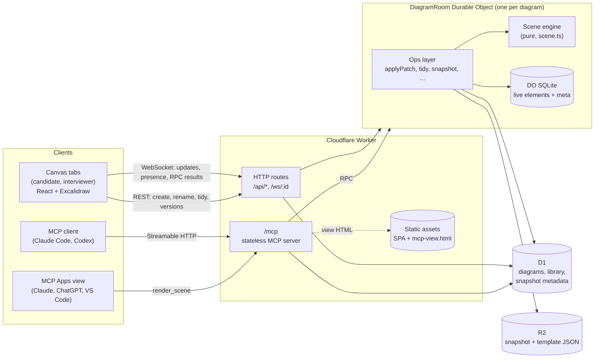
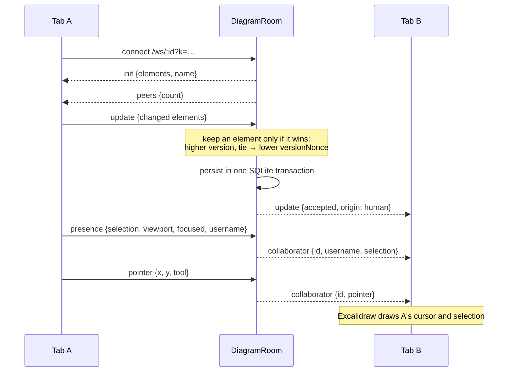
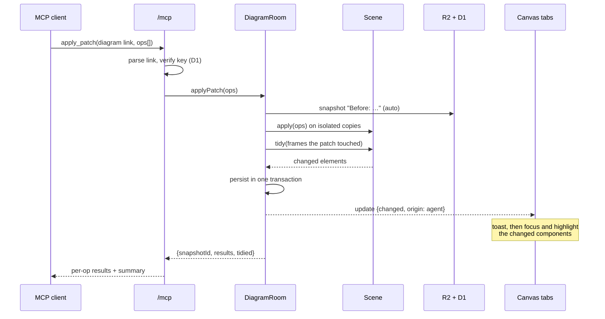
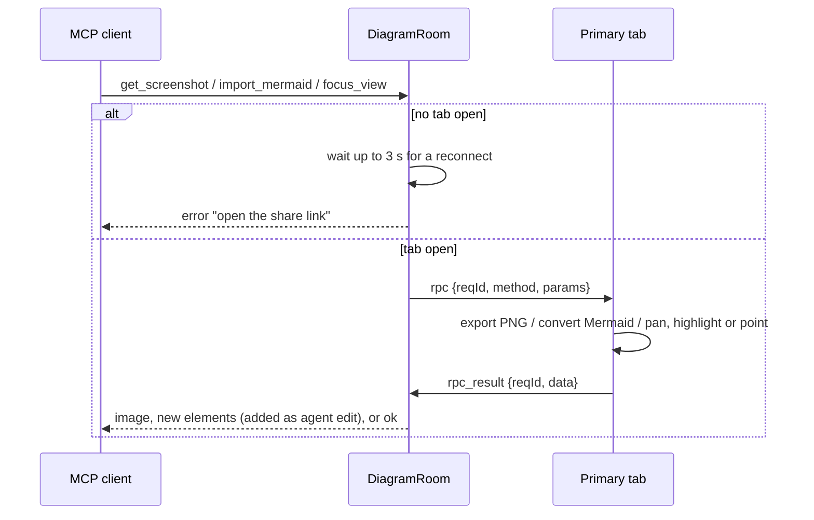
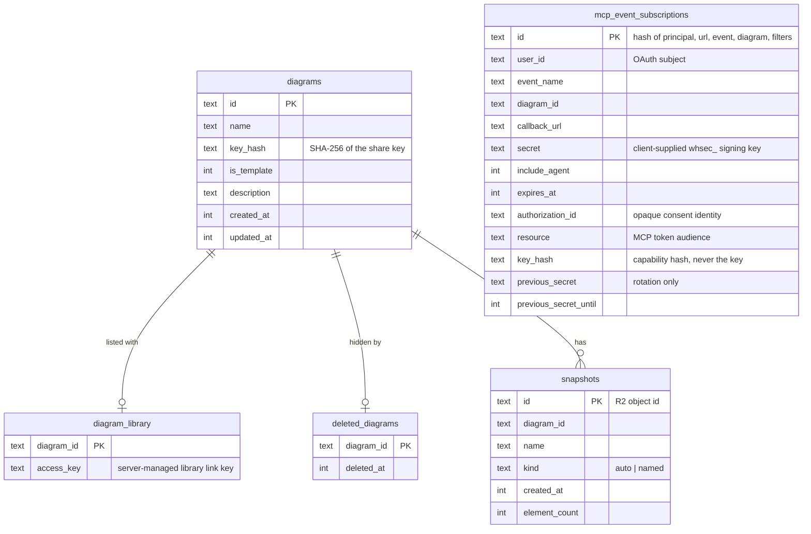
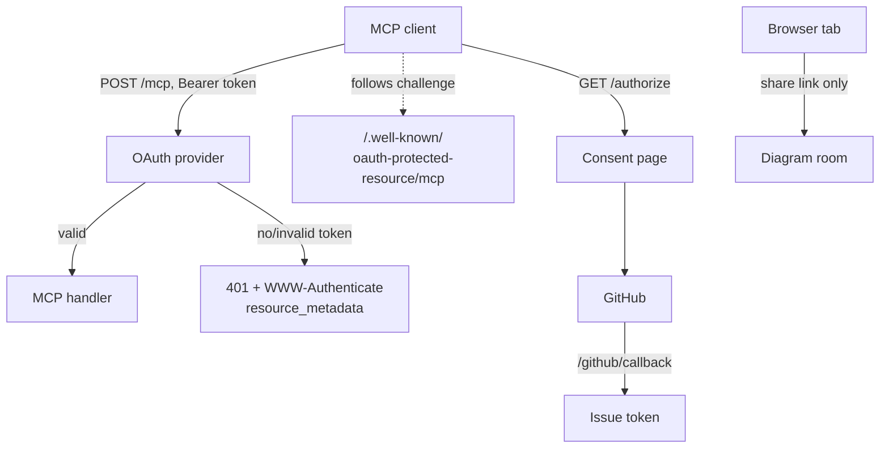
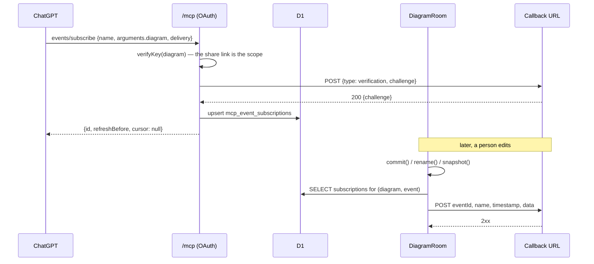
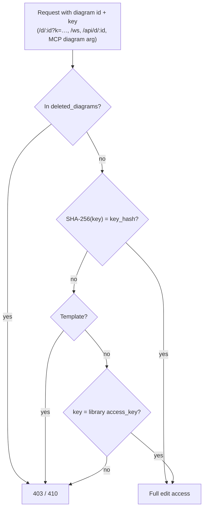
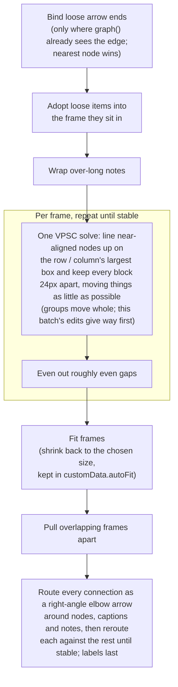
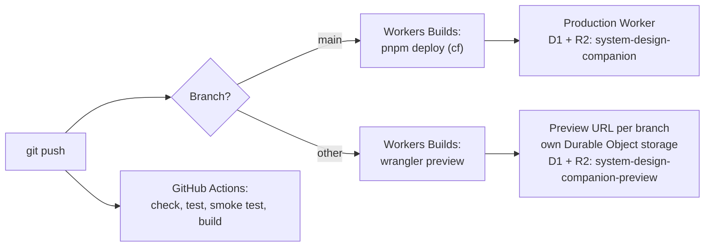

# System Design Companion — Design

A collaborative Excalidraw canvas that a candidate, an interviewer and an AI agent (Claude
Code or Codex over MCP) edit together in real time. What it does is in the
[README](../README.md); how to run it is in [setup.md](setup.md).

## Architecture

```mermaid
flowchart LR
    subgraph Clients
        Tab["Canvas tabs<br/>(candidate, interviewer)<br/>React + Excalidraw"]
        Agent["MCP client<br/>(Claude Code, Codex)"]
        AppView["MCP Apps view<br/>(Claude, ChatGPT, VS Code)"]
    end

    subgraph Worker["Cloudflare Worker"]
        Routes["HTTP routes<br/>/api/*, /ws/:id"]
        MCP["/mcp<br/>stateless MCP server"]
        Assets[("Static assets<br/>SPA + mcp-view.html")]
    end

    subgraph Room["DiagramRoom Durable Object (one per diagram)"]
        Ops["Ops layer<br/>applyPatch, tidy, snapshot, …"]
        Scene["Scene engine<br/>(pure, scene.ts)"]
        SQL[("DO SQLite<br/>live elements + meta")]
    end

    D1[("D1<br/>diagrams, library,<br/>snapshot metadata")]
    R2[("R2<br/>snapshot + template JSON")]

    Tab -- "WebSocket: updates, presence, RPC results" --> Routes
    Tab -- "REST: create, rename, tidy, versions" --> Routes
    Agent -- "Streamable HTTP" --> MCP
    AppView -- "render_scene" --> MCP
    Routes --> Room
    MCP -- "RPC" --> Room
    Routes --> D1
    MCP --> D1
    Ops --> Scene
    Ops --> SQL
    Ops --> R2
    Ops --> D1
    MCP -. "view HTML" .-> Assets
```

- **HTTP routing** (`src/worker/index.ts`) uses Hono with typed Cloudflare bindings.
  Zod schemas in `src/worker/request-schemas.ts` validate query parameters and JSON bodies
  through route-level `zValidator()` middleware before handlers read `c.req.valid()`.
  Invalid fields return the standard Zod validation response with status 400; malformed
  JSON also returns 400. JSON callers set `Content-Type: application/json` so Hono parses
  the body. The UI displays Zod issue messages alongside other API errors.
  Diagram and WebSocket routes share capability-key middleware, which runs before body
  validation. WebSocket requests pass directly to the Durable Object, while `/mcp` loads
  its handler on demand.
- **DiagramRoom** (`src/worker/room.ts`) is the core. It owns the live scene, merges
  concurrent edits, relays presence between tabs, and exposes an **ops layer**
  (`applyPatch`, `tidy`, `layout`, `snapshot`, `restore`, `focusView`, …). The HTTP
  routes and MCP are thin adapters over it, so a future in-room agent can reuse it.
- **Scene engine** (`src/worker/scene.ts`) is pure: it takes elements, applies semantic
  ops, placement, tidy and layout, and reports the changed elements. It has no I/O, which
  is why most of the test suite runs against it directly.
- **MCP endpoint** (`/mcp`, SDK v2 `@modelcontextprotocol/server`) is fully stateless, per
  the 2026-07-28 spec. The diagram's **share link is the handle**: every diagram tool takes
  it as the `diagram` argument, and the server stores nothing per agent. (The Agents SDK's
  `McpAgent` only supports SDK v1, so it isn't used.)
- **Frontend** (`src/app/`): Vite + React + `@excalidraw/excalidraw`, served as Workers
  static assets. Canvas chrome uses Excalidraw's own menus, sidebars, footer and
  collaborator rendering (see `AGENTS.md`).
- **MCP Apps view** (`src/view/`): a small bundle built into `public/mcp-view.html`.
  Clients that support MCP Apps show it for `get_scene`; it draws the scene with roughjs
  from `render_scene`.

## Edits and sync

### Human edits and presence

```mermaid
sequenceDiagram
    participant A as Tab A
    participant R as DiagramRoom
    participant B as Tab B
    A->>R: connect /ws/:id?k=…
    R-->>A: init {elements, name}
    R-->>A: peers {count}
    A->>R: update {changed elements}
    Note over R: keep an element only if it wins:<br/>higher version, tie → lower versionNonce
    R->>R: persist in one SQLite transaction
    R-->>B: update {accepted, origin: human}
    A->>R: presence {selection, viewport, focused, username}
    R-->>B: collaborator {id, username, selection}
    A->>R: pointer {x, y, tool}
    R-->>B: collaborator {id, pointer}
    Note over B: Excalidraw draws A's cursor and selection
```

- Merging uses Excalidraw's element versioning, and each tab reconciles incoming updates
  with `reconcileElements`. Deletions are tombstones (`isDeleted`), so they sync like any
  other change. The room drops a tombstone 7 days after the delete (`TOMBSTONE_TTL_MS`),
  and only while no tab is connected, so a tab can only miss a delete if it stayed
  offline for longer than that.
- Each tab's presence is stored on its WebSocket attachment, so it survives Durable Object
  hibernation. The most recently focused tab is the "primary" one for tab RPCs.

### Agent edits

```mermaid
sequenceDiagram
    participant C as MCP client
    participant M as /mcp
    participant R as DiagramRoom
    participant S as Scene
    participant St as R2 + D1
    participant T as Canvas tabs
    C->>M: apply_patch(diagram link, ops[])
    M->>M: parse link, verify key (D1)
    M->>R: applyPatch(ops)
    R->>St: snapshot "Before: …" (auto)
    R->>S: apply(ops) on isolated copies
    R->>S: tidy(frames the patch touched)
    S-->>R: changed elements
    R->>R: persist in one transaction
    R-->>T: update {changed, origin: agent}
    Note over T: toast, then focus and highlight<br/>the changed components
    R-->>M: {snapshotId, results, tidied}
    M-->>C: per-op results + summary
```

- Every `apply_patch`, `import_mermaid` and `layout` batch takes an automatic snapshot
  first, named after the change (`patchSnapshotName`), so `restore` undoes it.
- Scene edits run on cloned elements. If persisting fails, the transaction rolls back and
  nothing is broadcast.
- Agent-created elements are tinted violet and tagged `customData.author = "agent"`. The
  agent may modify or delete anything, with snapshots as the safety net.
- Nodes are addressed by element id or unique label; an ambiguous label is an error.
- Placement hints (`right_of`, `left_of`, `below`, `above`, `near`, `at`, a `frame`) are
  resolved to coordinates with overlap nudging. Existing layout is never reflowed unless
  `layout` is called.
- Library components are added with `add_node` and a `kind`. An icon is a group of parts
  plus a caption, but it behaves as one node for connecting, moving, resizing and deleting.

### Tab RPC: screenshots, Mermaid and pointing

Some work needs a real Excalidraw instance, so the room asks the primary open tab to do it.

```mermaid
sequenceDiagram
    participant C as MCP client
    participant R as DiagramRoom
    participant T as Primary tab
    C->>R: get_screenshot / import_mermaid / focus_view
    alt no tab open
        R->>R: wait up to 3 s for a reconnect
        R-->>C: error "open the share link"
    else tab open
        R->>T: rpc {reqId, method, params}
        T->>T: export PNG / convert Mermaid / pan, highlight or point
        T->>R: rpc_result {reqId, data}
        R-->>C: image, new elements (added as agent edit), or ok
    end
```

`focus_view` targets components or frames by label or id. `mode=focus` pans, zooms and
highlights; `mode=point` shows a temporary laser marker (`gesture=heart` draws a heart).
It changes no elements and creates no version.

## Storage

| Where     | What                                                                                                        |
| --------- | ----------------------------------------------------------------------------------------------------------- |
| DO SQLite | Live elements, tombstones from the last 7 days with their delete times, room meta.                          |
| D1        | Diagram index, capability key hashes, library links, deletions, snapshot metadata, MCP event subscriptions. |
| R2        | Snapshot and saved-template JSON (`snapshots/<diagram>/<id>.json`, `templates/<id>.json`).                  |
| KV        | OAuth tokens, codes and client registrations (`OAUTH_KV`); props encrypted.                                 |

```mermaid
erDiagram
    diagrams ||--o| diagram_library : "listed with"
    diagrams ||--o| deleted_diagrams : "hidden by"
    diagrams ||--o{ snapshots : "has"
    diagrams {
        text id PK
        text name
        text key_hash "SHA-256 of the share key"
        int is_template
        text description
        int created_at
        int updated_at
    }
    diagram_library {
        text diagram_id PK
        text access_key "server-managed library link key"
    }
    deleted_diagrams {
        text diagram_id PK
        int deleted_at
    }
    snapshots {
        text id PK "R2 object id"
        text diagram_id
        text name
        text kind "auto | named"
        int created_at
        int element_count
    }
    mcp_event_subscriptions {
        text id PK "hash of principal, url, event, diagram, filters"
        text user_id "OAuth subject"
        text event_name
        text diagram_id
        text callback_url
        text secret "client-supplied whsec_ signing key"
        int include_agent
        int expires_at
        text authorization_id "opaque consent identity"
        text resource "MCP token audience"
        text key_hash "capability hash, never the key"
        text previous_secret "rotation only"
        int previous_secret_until
    }

```

The D1 schema is created in code on first use (`ensureSchema`), so a new database needs
no migration step.

## Auth: two mechanisms

The MCP endpoint requires OAuth. The canvas does not.

```mermaid
flowchart TD
    C["MCP client"] -->|"POST /mcp, Bearer token"| P["OAuth provider"]
    P -->|"valid"| M["MCP handler"]
    P -->|"no/invalid token"| Ch["401 + WWW-Authenticate<br/>resource_metadata"]
    C -.->|"follows challenge"| PRM["/.well-known/<br/>oauth-protected-resource/mcp"]
    C -->|"GET /authorize"| A["Consent page"] --> G["GitHub"]
    G -->|"/github/callback"| T["Issue token"]
    B["Browser tab"] -->|"share link only"| WS["Diagram room"]
```

`@cloudflare/workers-oauth-provider` fronts `/mcp`: it answers unauthenticated
requests with a challenge, publishes RFC 9728 protected resource metadata, and
runs the authorize, token, revocation and registration endpoints. `src/worker/oauth.ts`
implements the part the library leaves to the app: the consent page and the GitHub
sign-in. `OAUTH_KV` holds tokens and codes; props are encrypted.

The verified token reaches the MCP handler as `McpPrincipal`
(`src/worker/principal.ts`), which `mcp.ts` passes to the SDK as `authInfo` and
`events.ts` uses as the subscription identity. The SDK never verifies tokens
itself — it is strictly the caller's claim. The provider verifies the token audience
and identity; the API handler enforces `mcp:read`, while write tool configurations
use the SDK's `requireScopes("mcp:read", "mcp:write")` challenge before execution.
GitHub subjects are encoded because the OAuth provider reserves `:` for token parts.

Browsers keep using capability links. Nobody signs in to draw.

## MCP events

Three event types, all webhook delivery, registered by hand on
`server.server` in `src/worker/events.ts` because the SDK does not implement the
draft `events/*` methods yet:

```mermaid
sequenceDiagram
    participant Chat as ChatGPT
    participant MCP as /mcp (OAuth)
    participant DB as D1
    participant Room as DiagramRoom
    participant Hook as Callback URL

    Chat->>MCP: events/subscribe {name, arguments.diagram, delivery}
    MCP->>MCP: verifyKey(diagram) — the share link is the scope
    MCP->>Hook: POST {type: verification, challenge}
    Hook-->>MCP: 200 {challenge}
    MCP->>DB: upsert mcp_event_subscriptions
    MCP-->>Chat: {id, refreshBefore, cursor: null}

    Note over Room,Hook: later, a person edits
    Room->>Room: commit() / rename() / snapshot()
    Room->>DB: SELECT subscriptions for (diagram, event)
    Room->>Hook: POST eventId, name, timestamp, data
    Hook-->>Room: 2xx
```

Design choices worth knowing:

- **The diagram link is the scope.** `arguments.diagram` goes through the same
  `verifyKey` as every tool, so a subscription can never widen access. The key
  itself is not stored: the subscription keeps its hash. The subscription id includes
  the user, opaque consent identity, callback URL, event, diagram id, key hash and
  normalized filter. Before every attempt, delivery checks expiry, cancellation,
  the current key hash and the original OAuth grant through public provider helpers.
  A different installation cannot unsubscribe or rotate this installation's secret.
- **Agent edits are withheld** unless the subscription sets `include_agent`.
  Otherwise every `apply_patch` returns to the agent as an event and it reacts to
  its own work. `room.ts` tags each change with its `origin` for exactly this.
- **Payloads carry counts, not elements.** The agent re-reads with `get_scene`.
  This keeps element data out of callback logs and limits injection surface.
- **Delivery is best-effort and off the critical path**, via `ctx.waitUntil` in
  the room. A slow or dead callback must never delay a human's edit. Three
  attempts with backoff; `410` and `413` are never retried.
- **Receiver hosts are explicitly trusted.** `MCP_EVENT_CALLBACK_HOSTS` is an exact
  allowlist. Both address families are resolved before every POST; non-public DNS
  answers, non-HTTPS URLs, credentials, fragments, IP literals and nonstandard ports
  are rejected. Redirects are disabled. Workers fetch preserves hostname TLS checks
  but does not expose IP pinning: the allowlist is a necessary trust boundary, not
  a replacement for pinned egress if arbitrary callback hosts are needed.
- **Signing-key rotation overlaps for five minutes.** D1 stores the prior secret
  and deadline; each attempt signs the exact serialized bytes with fresh timestamps.
  Retries keep the same event id. `410` removes the subscription; `413` and permanent
  client errors are not retried. Network failures, `408`, `429` and server errors
  receive up to three attempts with exponential backoff.
- **No replay.** There is no event log, so every response carries `cursor: null`
  and a missed event is not recoverable. A restart can drop a delivery silently.

## Auth: capability links (the canvas)

```mermaid
flowchart TD
    Req["Request with diagram id + key<br/>(/d/:id?k=…, /ws, /api/d/:id, MCP diagram arg)"] --> Deleted{"In deleted_diagrams?"}
    Deleted -- yes --> Deny["403 / 410"]
    Deleted -- no --> Hash{"SHA-256(key) = key_hash?"}
    Hash -- yes --> Allow["Full edit access"]
    Hash -- no --> Tpl{"Template?"}
    Tpl -- yes --> Deny
    Tpl -- no --> Lib{"key = library access_key?"}
    Lib -- yes --> Allow
    Lib -- no --> Deny
```

- There are no user accounts on the canvas. Holding a diagram's link is the permission to
  edit it, for people and agents alike. Hand the interviewer the same link. Agents must
  also be signed in to reach `/mcp` (see above), but the link is still what authorizes
  the board itself.
- **All diagrams** lists every non-template, non-deleted board with a server-managed
  library link, so any visitor to the deployment can open any board. A deployment is a
  shared workspace; put it behind access controls if it should be private.
- **Delete** is logical: the diagram is added to `deleted_diagrams`, open sockets are
  closed, and both links stop working. Data and snapshots remain for recovery.

## Formatting without overriding

Prevention on agent edits: `add_note` makes Excalidraw sticky notes, whose labels wrap at about 28 characters inside the note; free-text notes wrap at about 64. New nodes and notes join the
frame of whatever they are placed relative to, or the frame they land inside. Moving a
frame moves its contents, and a frame that grows pushes overlapping frames right or down.

**`tidy`** runs from the MCP tool, the **Tidy** button (only the frames touched by the
selection, if any), and automatically on the frames each agent patch touched:

```mermaid
flowchart TD
    A["Bind loose arrow ends<br/>(only where graph() already sees the edge;<br/>nearest node wins)"] --> B["Adopt loose items into<br/>the frame they sit in"]
    B --> C["Wrap over-long notes"]
    C --> D
    subgraph Loop["Per frame, repeat until stable"]
        D["One VPSC solve: line near-aligned nodes up on<br/>the row / column's largest box and keep every block<br/>24px apart, moving things as little as possible<br/>(groups move whole; this batch's edits give way first)"] --> F["Even out roughly even gaps"]
    end
    F --> G["Fit frames<br/>(shrink back to the chosen size,<br/>kept in customData.autoFit)"]
    G --> H["Pull overlapping frames apart"]
    H --> I["Route every connection as a right-angle elbow arrow<br/>around nodes, captions and notes, then reroute<br/>each against the rest until stable; labels last"]
```

- It never changes connections, labels, colours or relative order.
- Connections are routed by `src/worker/route-orthogonal.ts`: A* over a sparse grid of obstacle
  edges and the channel centres between them, costing length, bends (40), crossing another route
  (240) and running along one (4/px). Ports are side midpoints plus points ±24px along the side
  and one lined up with the other shape, so parallel arrows can run side by side. Shortest routes
  go first, then each is ripped up and rerouted against the others (up to 3 rounds). Each label
  goes on the clearest stretch of its route, pinned with Excalidraw's `labelPosition`. Arrows are
  written as Excalidraw elbow arrows, bound by fixed point to the icon node (not its artwork or
  caption); an arrow whose ends still sit on their fixed points is left alone.
- Overlap removal and alignment are one weighted least-squares problem
  (`src/worker/solve-layout.ts`), solved with VPSC (Dwyer, Marriott & Stuckey, the solver
  behind WebCola): an x pass for pairs that are cheaper to separate sideways, then a y pass.
  Rows can only separate sideways and columns only vertically; if alignment still conflicts
  with separation, separation wins. Blocks the current batch added or edited weigh 1, the
  rest 10, so an agent's new node moves out of the way of what someone placed.
- It is idempotent: a second run changes nothing.
- It snapshots first, but only when something will change.
- The full dagre `layout` stays opt-in.
- `tests/scene-tidy.test.ts` uses the metrics `scripts/tidy-check.ts` prints to check that
  tidy makes no template or seeded messy diagram worse.

## MCP surface

| Tool                                                           | Purpose                                                             |
| -------------------------------------------------------------- | ------------------------------------------------------------------- |
| `join_session(diagram)`                                        | Validate the link, return a summary                                 |
| `create_diagram(name, template?)`                              | New diagram; returns its link (the handle)                          |
| `get_scene(diagram, format)`                                   | `graph` (nodes/edges/frames/notes/sketches) or `raw`; MCP Apps view |
| `get_selection(diagram)`                                       | Current human selection + viewport, as a graph                      |
| `get_screenshot(diagram, scope)`                               | PNG rendered by an open tab                                         |
| `apply_patch(ops[])`                                           | Batched semantic ops, snapshotted and tidied                        |
| `tidy(frame?)`                                                 | Non-destructive cleanup; returns what it did                        |
| `layout(direction, scope?)`                                    | Explicit dagre auto-layout                                          |
| `import_mermaid(source)`                                       | Converted by the open tab, added as agent elements                  |
| `focus_view(targets, mode, gesture?)`                          | Pan/highlight or point at components in the open tab                |
| `snapshot(name)` / `list_snapshots()` / `restore(snapshot_id)` | Versions                                                            |
| `list_templates()` / `save_as_template(name)`                  | Starter layouts                                                     |
| `render_scene`                                                 | Elements for the MCP Apps view (called by the view, not the model)  |

**Prompts**: `review_design`, `suggest_next_step`, `estimate_capacity`.
**Resources**: `rubric://system-design`, `components://catalog`, and the view
`ui://system-design-canvas/diagram.html`.
**Events**: `diagram.changed`, `diagram.renamed`, `diagram.checkpointed` — webhook
delivery only, see [MCP events](#mcp-events).

## Deployment

```mermaid
flowchart LR
    Push["git push"] --> Branch{"Branch?"}
    Branch -- main --> Deploy["Workers Builds:<br/>pnpm deploy (cf)"] --> Prod["Production Worker<br/>D1 + R2: system-design-companion"]
    Branch -- other --> Preview["Workers Builds:<br/>wrangler preview"] --> PrevWorker["Preview URL per branch<br/>own Durable Object storage<br/>D1 + R2: system-design-companion-preview"]
    Push --> CI["GitHub Actions:<br/>check, test, smoke test, build"]
```

Previews get isolated Durable Object namespaces automatically; D1 and R2 come from the
`ctx.isPreview` branch in `cloudflare.config.ts`, so previews never touch production data. All
previews share the one preview database and bucket.

## Deferred (post-interview)

- In-room agent with a chat panel and push reactions.
- Anchored comment threads.
- GitHub OAuth.
- Proposal/ghost layer.
- Server-side lint.

## OAuth and event implementation references

The implementation was checked against these primary sources and samples:

- [OpenAI MCP Events](https://developers.openai.com/plugins/build/mcp-events), including
  the Node.js delivery sample and subscription lifecycle requirements.
- [Cloudflare MCP authorization](https://developers.cloudflare.com/agents/model-context-protocol/protocol/authorization/).
- [Workers OAuth Provider](https://github.com/cloudflare/workers-oauth-provider) and its
  [split-worker authorization sample](https://github.com/cloudflare/workers-oauth-provider/blob/main/examples/split-workers/auth-server/index.ts)
  and [end-to-end tests](https://github.com/cloudflare/workers-oauth-provider/blob/main/examples/split-workers/e2e.test.ts).
  This repo keeps the supported combined `OAuthProvider` because its authorization server
  and resource server share one Worker; no second Worker or Agents SDK wrapper is needed.
- [Public fetch routing](https://developers.cloudflare.com/workers/configuration/compatibility-flags/#global-fetch-strictly-public),
  [Workers HTTPS limitations](https://developers.cloudflare.com/workers/runtime-apis/nodejs/https/)
  and [Cloudflare DNS JSON queries](https://developers.cloudflare.com/1.1.1.1/encryption/dns-over-https/make-api-requests/dns-json/).
